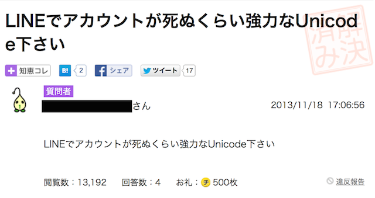
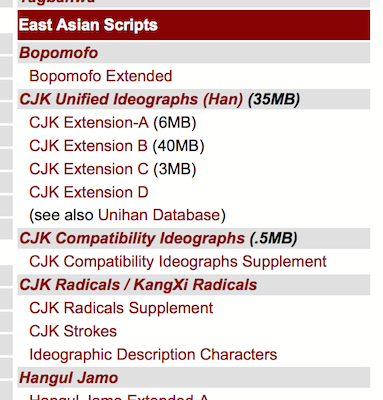
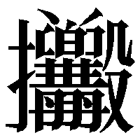
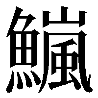
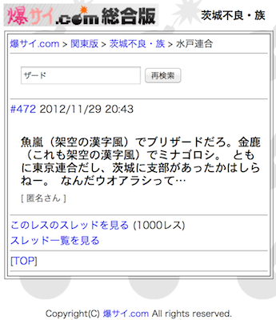
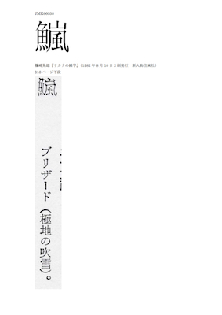

% 漢字の闇
% Ryusei Yamaguchi
% 2014-06-16 coinsLT #0

# About Ryusei

* coins11 （ACでない）
* a phantom WORDian
* SCORE―Symbolic Computation Research Group
* [Twitter mandel59](https://twitter.com/mandel59)
* 文字と記号の人

# 情報学類 先輩の成果物

* SoftEther by 登 大遊, 2007年卒
* Ruby by Matz, 1990年卒
* LINE by 森川 亮, 1989年卒

# LINE

[🔍 LINE+Unicode](http://www.bing.com/search?q=LINE+Unicode)

# 強力なUnicode

- 特殊なメッセージを送ることでLINEクライアントを重くする
- 相手は死ぬ

# Unicode is 何

> * ユニコードは、すべての文字に固有の番号を付与します
> * プラットフォームには依存しません
> * プログラムにも依存しません
> * 言語にも依存しません

――[What is Unicode in Japanese](http://www.unicode.org/standard/translations/japanese.html)

# 要は

世界中の文字を収録した符号化文字集合

# すべての文字

* ラテン文字 a, b, c, ...
* ギリシャ文字 α, β, γ, ...
* キリル文字 а, б, в, ...
* グルジア文字 ა, ბ, გ, ...
* ルーン文字 ᚠ, ᚢ, ᚦ, ...
* タイ文字 ก, ข, ค, ...
* かな あ, い, う, ...
* 絵文字 😂, 🍺, 💩 ...
* 漢字

# CJK Unified Ideographs

[Unicode 6.3 Character Code Charts](http://www.unicode.org/charts/)

# Unicodeに漢字どれくらいあるのっと

* CJK Unified Ideographs (BMP) : 20,902 + 22 + 8 + 8 + 1
* CJK Compatibility Ideographs (BMP) : 12 (互換漢字除く)
* CJK Extension-A (BMP) : 6,582
* CJK Extension-B (SIP) : 42,711
* CJK Extension-C (SIP) : 4,149
* CJK Extension-D (SIP) : 222
* 合計 74,617 字 (内 beyond-BMP 47,082字)
* まだ増える!!

# Ideographic Rapporteur Group

* Unicodeに追加すべき漢字について
* いろいろ調査し
* アドバイスしているグループ

# 難読漢字の歌

> * 閄（ものかげからきゅうにとびだしてひとをおどろかせるときにはっするこえ）に
> * ビックリして辺りを 𥇛（きょろきょろみまわす）
> * 䁶（まばたきしない）まま何度も 𠱐（わらおうとする）と
> * 𥆞（めがまわる）ほどの 𫙹（ブリザード）で 𠤾（ふねがしずむ）から
> * 𩏊（せまりくるあらなみ）をひたすら耐えるのさ 狷（こころがせまい）僕らだから

――[なんだかとっても!いいかんじ](http://dic.nicovideo.jp/a/%E3%81%AA%E3%82%93%E3%81%A0%E3%81%8B%E3%81%A8%E3%81%A3%E3%81%A6%E3%82%82!%E3%81%84%E3%81%84%E3%81%8B%E3%82%93%E3%81%98), 2008年

[👉 ニコニコ動画](http://www.nicovideo.jp/watch/sm3604366)

# Unicodeによって

* 歌詞が全部書けるようになった
* ……（ガンダム）以外は
* さすがに創作漢字はUnicode収録されない……?

# ところで

- 粍, 碼, 鉑
- それぞれ ミリメートル, ヤード, プラチナ と読む
- 訓が外来語の漢字はそれなりにあるが
- なぜ  (U+2B679) がブリザードなのか

# 𫙹

[魚嵐（架空の漢字風）でブリザー…水戸連合｜爆サイ.com関東版](http://bakusai.com/thr_res_show/acode=3/bid=877/tid=2276168/rid=119090903/word=%83U%81%5B%83h/)

# 事実

* 族のグループ名由来の創作漢字がUnicodeに収録されている
* 「鏕」は架空の漢字じゃないです（「鏖」の異体字）
* どうしてこうなった

# 想定される経路

* 斎賀秀夫 (1978). 『漢字と遊ぶ―現代漢字考現学』 毎日新聞社
* ↑ 東京都板橋区の塀の落書き「𫙹」が紹介される
* 篠崎晃雄 (1982). 『おもしろいサカナの雑学』 新人物往来社
* ↑ 「𫙹」が記載される
* 今昔文字鏡（漢字に特化した商用の符号化文字集合）
* ↑ 『おもしろいサカナの雑学』を典拠に𫙹を収録する

# そしてUnicodeへ……

[Documents for IRG26](http://appsrv.cse.cuhk.edu.hk/~irg/irg/irg26/IRG26.htm)

# おわり

# おまけ イシミツ

* 白土三平『栬𨊂𠎁潢』
* 栬𨊂𠎁潢は「忍びいろは」の暗号文
* 𨊂, 𠎁という漢字は存在しない
* この作品が国会図書館に収蔵されているためにJIS規格入りした
* 当然Unicodeにも入った
